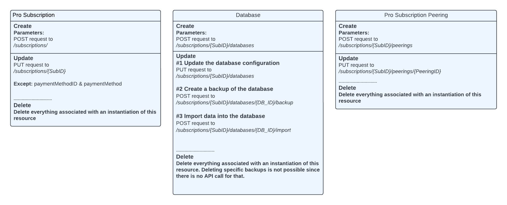

# Redis Cloud AWS CloudFormation Public Extensions 
Code Health -> Link to automated tests  
Contract Testing -> Link to automated tests


## About this project
### What is a CloudFormation Public Extension?
A CloudFormation Public extension is typically a resource type developed from a third-party publisher, like Redis. Extensions allow AWS customers to integrate RedisCloud-specific resources, which are only available over the Redis API, in their CloudFormation templates. 

The AWS CloudFormation registry serves as a centralized hub to discover, manage, and provision these extensions.

### What are the capabilities of Redis' extensions?
There are currently three resource types can be provisioned via CloudFormation. The resource types act as a wrapper around our API [1]. How resource types relate to the API can be seen in the diagram below.



### Bugs and feature requests
[...]

### CloudFormation examples
[...]

## Getting Started
### 0. Prerequisites
- Redis Cloud API keys are required to use CloudFormation Public Extensions. Please have your API Keys ready

### 1. Store your API keys in Secrets Manager
#### Automated way
- Find the *CreateSecrets.yml* in the root of this project.
- Run this CloudFormation template and replace the placeholders for secrets manually once the creation is done.
- The secret will be set up following this format:
``` 
SecretName: cfn/profile/{ProfileName}
SecretValue: {"PublicKey": "YourPublicKey", "PrivateKey": "YourPrivateKey"}
```

#### Alternative way
- If you desire a different naming convention for your secrets, feel free to either change the CloudFormation Template or create the secret in any other way. Please keep in mind to change the secrets name in the type-configuration in step 4. 

### 2. Activate the extension
- Activate the extension from the Extension Registry. This can we done in the CloudFormation UI but also programatically.

### 4. Setting up credentials to Redis API

- In the command below
   - Change the region parameter to the AWS region you required
   - Change  the key value information if you used a different secret name from Step 1
- Run the command in CloudShell or similar.

```
aws cloudformation set-type-configuration \
    --region eu-west-1 \
    --type-name "Redis::CloudFormation::ProSubscription" \
    --type RESOURCE \
    --configuration-alias default \
    --configuration '{"RedisAccess": {"xapikey": "{{resolve:secretsmanager:"Secret Name":SecretString:"Secret Key for x_api_key"}}", "xapisecretkey": "{{resolve:secretsmanager:"Secret Name":SecretString:"Secret Key for x_api_secret_key"}}"}}'
```

[1] https://api.redislabs.com/v1/swagger-ui/index.html#/


